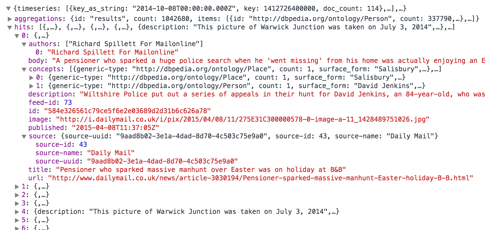

# AP-what?
*Those already familiar with APIs may want to skip straight to the [BBC API introduction](https://github.com/basilesimon/using-an-api-tutorial/blob/master/tutorial.md#what-you-will-find-in-the-bbc-api) and [further reading](https://github.com/basilesimon/using-an-api-tutorial/blob/master/tutorial.md#beyond-this-tutorial).*

Today, we turn our focus towards APIs. Chances are you've already used some of them, quite a lot, without even knowing about them:

* ever clicked on a Twitter "Share this" button?
* ever opened Facebook or Twitter?

Well, you've used an API!

In short, APIs are a way to interact with an Internet service. A magnificent and powerful one. They can be used to:

* **fetch data** from a provider (that is what third-party Twitter clients do when tweets appear on your screen),
* or **send data** to a service (e.g., when you send a tweet via a third-party client).

For this tutorial, we are going to use the *BBC linked data API*. But let's just say that linked data expresses relationships between concepts present in content. For example, a BBC article mentioning "David Cameron" will be considered by the machine as being *about* David Cameron, our Prime minister. You could then ask the service "show me all articles *about* David Cameron *and* Nigel Farage," for example.

# API keys and rate limiting
A quick word about security here: quite often, content providers restrict the use of their APIs. They will often require you to register for an API key (think of an API key as a user account) to control who is using the API; and will often restrict the number of times per hour each API key can be used (known as "rate limiting").

# What you will find in the BBC API
We call this API "the Juicer." It has been developed by BBC News Labs, and here is how it works:


* The Juicer scrapes news articles from the BBC and roughly 150 other news organisations, automatically. It ingests them in its database, identifying the title, the authors, the source, images, external links.
* It then performs entity extraction: in the articles' bodies, it will recognises some concepts ("David Cameron", "smoking", "Leicester", "Apple Inc"...), which can be people, places, organisations, or intangibles.
* It will match these concepts with a unified concepts base containing information about these concepts, thus providing some consistency.
* Finally, it will draw relationships between the concepts: how often they co-occur together, with which other concepts they appear, their frequency over time...

Every step of this process can be interrogated by talking to the API directly. You might only be interested by reading articles about the geographic zone 15 miles around your current GPS position, for example. Or you might just want to know what are the other politicians co-occurring with Nigel Farage in the last two months, and in which proportions. Or, you might be curious to know who is mentioned the most alongside Adolf Hitler in news articles.

Now, it might seem all a bit silly and broad, but you can use these APIs for quite nice purposes. If you have downloaded the new BBC News smartphone app (available on Android and iOS), you probably noticed that you can *follow* topics, such as your constituency or geographical area, major news developments ( *Islamic State crisis*, *counter-terrorism*, *Jeremy Clarkson*, *Cymru*, *Election 2015*...). These pages are aggregated automatically by the APIs (and probably involve a certain amount of human curation, but I must admit I don't know a whole lot about that).

# Making requests
In order to fetch or push data using an API, we must send a request. This will usually take the form of a URL, including a query and an API key.

### Example queries
Try the following queries by opening the URLs in your browser:
[insert stuff here]

# Getting a response
After you've sent your query, the server will reply in a certain format. One of the most common is JSON (which stands for *JavaScript Obect Notation*). This format is very standard and easy to parse in any language, and though it can be a bit bigger than flat CSV datasets, it is quite good at expressing relationships and hierarchy. JSON is also the format returned by the Juicer, and thus the one that we will use for this tutorial.

# Exploiting the received data
Okay, so now that we're comfortable with the Juicer API, it's time to actually put the data you've queried to good use. One of the most simple and frequent thinkg you'll do with data obtained is to throw some bits of it into a web page. 

This is surprisingly easy with some Javascript (actually, *jQuery*, but sssh, don't wake up the trolls).

Today, we will cover how to:
* Load the API's five most recent news articles about *London*.
* List the headlines and descriptions of these articles on a web page.

#### An HTML5 skeleton
Just to get you started, here is essentially all you need to get started with using an API programmatically. Create a file called `index.html` using a text editor (I recommend [Sublime Text](https://www.sublimetext.com)) and paste this bit of code into it. 

Note that we included only the bare minimum, with the addition of jQuery - a very successful JS library.

```html
    <!DOCTYPE HTML>
    <html>
    <head>
      <meta charset="utf-8" />
      <title>API with jQuery</title>
      <script src="https://cdnjs.cloudflare.com/ajax/libs/jquery/2.1.3/jquery.min.js"></script>
    </head>

    <body>
      <h1>Hello!</h1>
      <button>Get JSON data</button>

      <script>
        // some Javascript will go here
      </script>

    </body>
    </html>
```

#### Making a request
To cut to the chase: jQuery has a brilliant method for getting JSON back from an API without having to go through parsing it: `$.getJSON()`. It works like this:

```javascript
    // Your API key
    var apikey = ;

    // The query you want to run
    var query = "http://data.test.bbc.co.uk/bbcrd-juicer/articles?q=London&apikey=" + apikey;

    $("button").click(function(){
      $.getJSON(query, function(data){
        console.log(data);
      })
    });
```

Now open `index.html` in your [favourite browser](https://www.mozilla.org/en-GB/firefox/new/) and open the *Developer Tools* (`Shift + Ctrl + K` on Firefox, `Shift + Ctrl + J` on Chrome).

Magic happened: you can now see the data!

> **Note:** If you don't have an API key for the BBC API, use [this cached version](https://rawgit.com/basilesimon/using-an-api-tutorial/master/cacheJSON.json) instead.
>
> So in the above example, you should use this line:
> 
> `var query = "https://rawgit.com/basilesimon/using-an-api-tutorial/master/cacheJSON.json";`

#### Using the request to build your web page
Good, good. Now we've got some JSON back directly in the browser. What do you say we take parts of this JSON and injects it directly into our web page to create some content, eh?

If you paid attention earlier, you know that we're querying to the Juicer a list of articles mentioning *"London"*. This JSON looks like this: 



Now, some technicalities:

* A JSON is made to be navigated in, hierarchically. In that case, we're going to want to target the `hits` group, and leave `aggregations` and `timeseries` alone. When we're into `hits`, we have a list (numbered from 0, as it is the norm in most programming languages). Into each element of this list, there's the information we will want to display: a *title*, a *url*, a *description*...
* To access properties in the JSON, consider that the dot (`.`) expresses levels of hierarchy. Thus, considering that `data` is the variable representing your JSON, `data.subdata` is a sub-element of the JSON object. And `data.subdata.article` is a sub-element of `subdata`, which is itself a sub-element of the JSON object. Go deeper with dots.
* In this particular case, if I want to access the `title` element, you might expect that we need to read (assuming that `data` represents the JSON object we queried) `data.hits.title`. *However, that won't work.*
* This is because when you have a list, you need to say which element you want to read in the list (numbered from 0, remember). Thus, to read the first element (trust me on this one), you will want to read `data.hits[0].title`. Try to `console.log` this after your `getJSON`.
* When you have several elements in a list, you can easily write loops to perform a single operation on each one, without having to write the instruction *x* times. That's one of the things that makes computers so good at repetitive tasks.

Anyway, to the code:

```javascript
    var apikey = ;
    var query = "http://data.test.bbc.co.uk/bbcrd-juicer/articles?q=London&apikey=" + apikey;

    $.getJSON( query, function( data ) {
      var items = [];       // We create `items`, which is an empty list. We'll fill this with the content we want on the page.

      // Then, with `$.each()`, we're writing this loop to peform an operation on each element of `data.hits`.
      $.each( data.hits, function( key, val ) {     

        // We are then *pushing* a piece of HTML to `items`, that we created earlier.
        // This piece of HTML contains a `<li>` element (a list item) which, look at this, has `val.title` for value.
        // `val.title`, I forgot to explain, represents `data.hits.title`, that's just a shortcut we declared.
        items.push( "<li>" + val.title + "</li>" );
      });

      $( "<ul/>", {                 // Then, after the white line, we're grabbing the `<ul>` element in our HTML,
        html: items.join( "" )      // And saying that its HTML should be what's contained in `items`.
      }).appendTo( "body" );        // Finally, we *append* these list elements to our HTML *body*.
    });
```

Are you still here? Good. Refresh the page. Magic happened.

Nothing changed from before at the top: we give it an API key, a query to perform with this API key, and we're using `getJSON()` to make the query.

> **Note:** Reminder that if you don't have an API key for the BBC API, use [this cached version](https://rawgit.com/basilesimon/using-an-api-tutorial/master/cacheJSON.json) instead. Like so:
>
> `var query = "https://rawgit.com/basilesimon/using-an-api-tutorial/master/cacheJSON.json";`

# Challenge round!

Here's three tasks to take this web page a step further. Answers are at the bottom of this page, but I'll give you a big hint: each of these requires no more than a single line of code to be changed.

## Make each headline hyperlinked
Wouldn't it be useful to be able to click through to each article? The URLs are returned in the API response - can you get those into the HTML?

## Fetch articles on David Cameron instead of London
London is boring. So is the prime minister, but at least his name poses a challenge: that space in the URL will need encoding.

## Fetch articles published before 2010
The API request URL contains a query (`q=London`) and an API key (`apikey={apikey}`). But it can contain other things, too. Check [the API documentation](http://docs.bbcnewslabs.co.uk/Juicer-2.html) for additional parameters, including one that can limit the time period of returned articles.

# Beyond this tutorial
You pretty much know the basics right now, so here are a couple of things you could do to learn a bit more.

#### Getting to know Juicer better with Postman
You don't need much to talk to an API. Although some tools are nicer than the others.
Have a look at [Google Chrome extension Postman](https://chrome.google.com/webstore/detail/postman-rest-client/fdmmgilgnpjigdojojpjoooidkmcomcm?hl=en), which is a pretty tool to make requests clear to humans. Go ahead and install it!

You can them import the Juicer API using [this URL](https://www.getpostman.com/collections/cebe998a209d9862135b). This allows you to easily try out the API and explore how it works without writing any code.

You will need to configure an 'Environment' within Postman to be able to make cals:


And you best ally is, as always, [the documentation](http://docs.bbcnewslabs.co.uk/Juicer-2.html)!

### Want to code a bit more?
Why not writing a [Google News](https://news.google.com/)-y kind of thing? If you've followed the tutorial, here's what you should do:

* List the titles (as we did before)
* Transform the list elements into links (`<a>` elements)
* Change the source of the links to the corresponding URLs (tip: change `href`)

# The answers

## Make each headline hyperlinked

Each item in the API response contains not only a `title`, but also a `url`. We can use it in a hyperlink like so:

```js
items.push( "<li><a href='" + val.url + "'>" + val.title + "</a></li>" );
```

## Fetch articles on David Cameron instead of London
We can switch out "London" for "David Cameron" easily enough, but that space will need encoding as `%20`.

```js
var query = "http://data.test.bbc.co.uk/bbcrd-juicer/articles?q=David%20Cameron&apikey=" + apikey;
```

## Fetch articles published before 2010

We'll need to make use of the `published_before` URL parameter, as noted in the [API documentation](http://docs.bbcnewslabs.co.uk/Juicer-2.html), to achieve this:

```js
var query = "http://data.test.bbc.co.uk/bbcrd-juicer/articles?q=London&published_before=2010-01-01T00:00:00.000Z&apikey=" + apikey;
```

